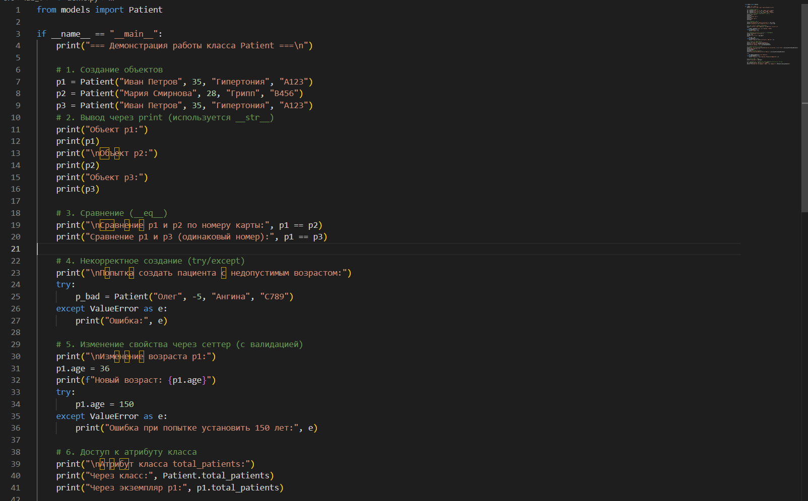
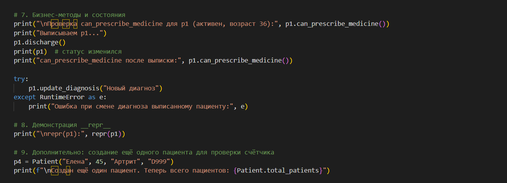
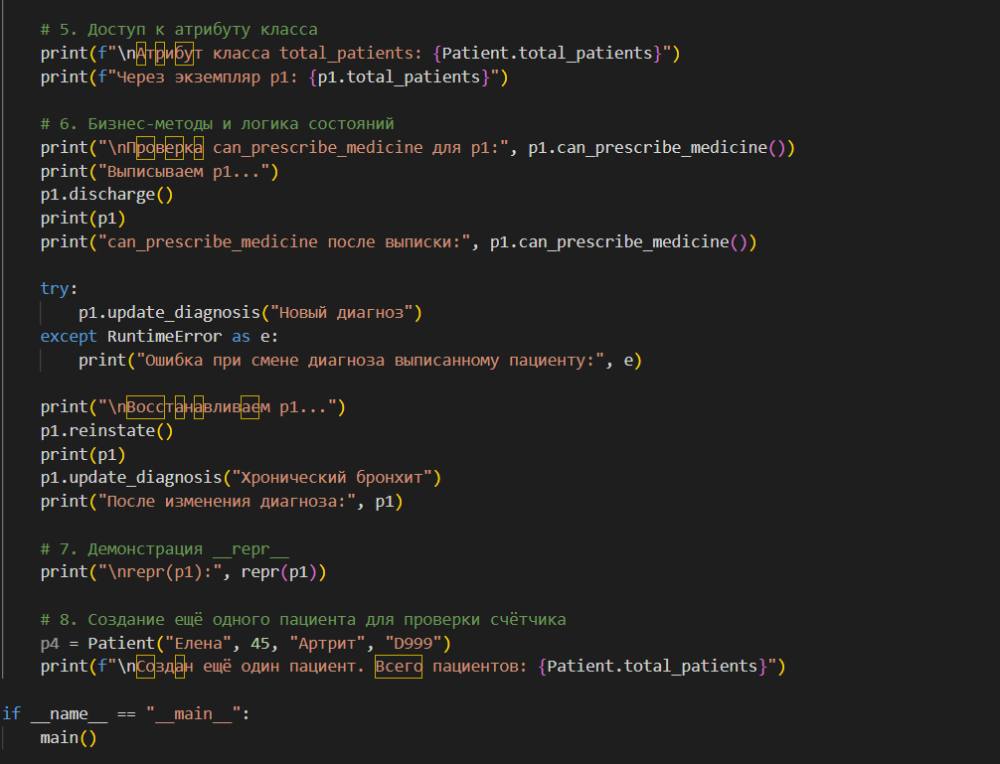

# Лабораторная работа №1:

## Вариант: Медицина (класс Patient)
### Атрибуты класса:

#### `total_patients` – счётчик созданных экземпляров (общий для всех объектов).

## Конструктор __init__(self, name, age, diagnosis, record_number)
### Выполняет проверку входных данных с помощью отдельных методов валидации, инициализирует поля и увеличивает счётчик total_patients:

### Атрибуты экземпляра (приватные поля):

#### `__name` – имя пациента (строка, непустая)

#### `__age` – возраст (целое число, 0–130)

#### `__diagnosis` – диагноз (строка, может быть пустой)

#### `__record_number` – уникальный номер медицинской карты (строка или число)

#### `__is_active` – состояние пациента (активен / выписан, булево)

## Методы валидации 
### `validate_name(name)`

### `validate_age(age)`

### `validate_diagnosis(diagnosis)`

### `validate_record_number(record_number)`

### Каждый метод вызывает TypeError или ValueError при несоответствии требованиям. Валидация вынесена отдельно для повторного использования в сеттерах свойств:

## Свойства (@property)
### Для каждого закрытого поля создано свойство с геттером, а для изменяемых полей (name, age, diagnosis) – также сеттер с валидацией. Поле record_number доступно только для чтения (уникальный номер не должен меняться). Состояние is_active также только для чтения – изменяется через бизнес-методы:

## Магические методы
### `__str__` – возвращает удобочитаемое представление пациента (используется в print).

### `__repr__` – возвращает строку, которая позволяет воссоздать объект (полезно для отладки).

### `__eq__` – сравнивает пациентов по уникальному номеру карты (_record_number).

## Бизнес-методы (логика, зависящая от состояния)
### `discharge()` – выписывает пациента (устанавливает _is_active = False). Если пациент уже выписан, выбрасывается исключение.

### `update_diagnosis(new_diagnosis)` – изменяет диагноз только для активного пациента. Проверяет валидность нового диагноза.

### `can_prescribe_medicine()` – возвращает True, если пациент активен и его возраст ≥ 18 (пример правила).

## Сценарий №1(Валидация данных)

## Сценарий №2(Логические состояния)

## Сценарий №3(Изменения состояния)

