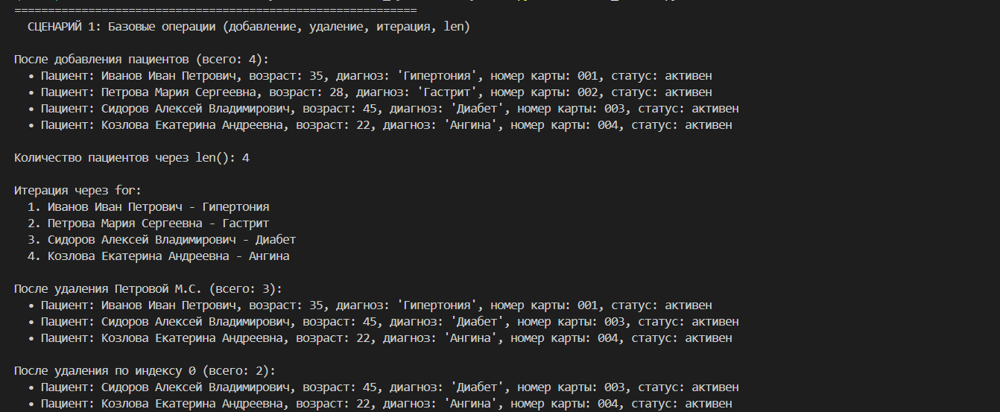
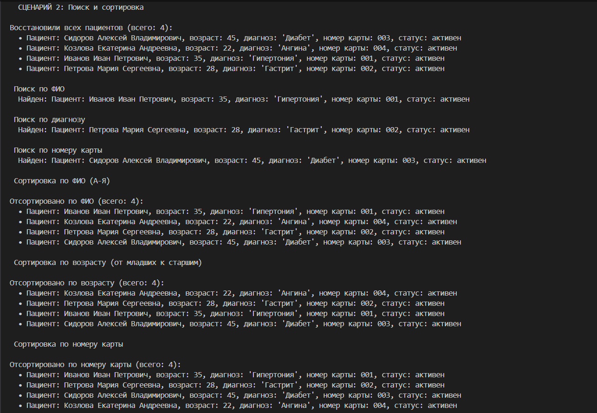
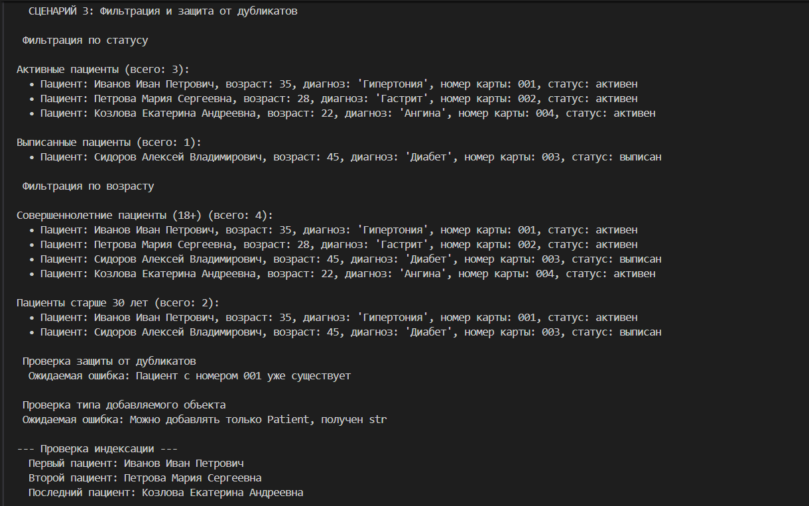
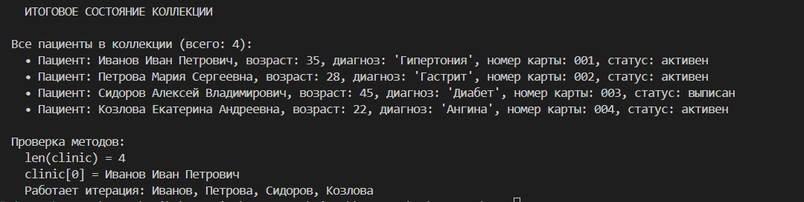

# Лабораторная работа №2: Коллекция объектов (PatientList)

## Вариант: Медицина (класс Patient из ЛР-1)

# *Основные методы*
### `add(patient)`
  
  * Добавляет объект Patient в коллекцию.

 * Проверяет тип: можно добавлять только экземпляры Patient.

  * Запрещает дубликаты – два пациента с одинаковым record_number не могут находиться в коллекции
 
### `remove(patient)`
* Удаляет конкретный объект пациента из коллекции.

* Если пациента нет  – выбрасывает ValueError.
### `remove_at(index)` 
* Удаляет пациента по индексу (поддерживаются отрицательные индексы, например -1 для последнего).
### `get_all()`
* Возвращает копию списка всех пациентов.

# *Магические методы*
### `__len__()`
* Возвращает количество пациентов в коллекции.
Позволяет использовать len(collection).

### `__iter__()`
* Возвращает итератор по списку пациентов.
Позволяет писать for patient in collection:.

### `__getitem__()`
* Поддерживает индексацию: collection[0], collection[-1].

* При неверном индексе выбрасывает IndexError.

# *Поиск* 
### `find_by_fio(fio_part)`
* Возвращает список пациентов, у которых в ФИО встречается подстрока fio_part (регистронезависимо).

* Если ничего не найдено – ValueError.

### `find_by_id(record_id)`
* Возвращает первого пациента с указанным номером медицинской карты (record_number).

* Номер уникален, поэтому возвращается один объект.

* Если не найден – ValueError.

### `find_by_diagnosis(diagnosis)`
* Возвращает список пациентов, чей диагноз содержит подстроку diagnosis (регистронезависимо).

# *Сортировка*
* Все методы сортируют коллекцию на месте (изменяют исходный порядок).

* `sort_by_fio(reverse=False)` - 
Сортирует по ФИО.

* `sort_by_age(reverse=False)` -
Сортирует по возрасту (по возрастанию, если reverse=False).

* `sort_by_record_number(reverse=False)` - 
Сортирует по номеру медицинской карты (как строки).

# *Фильтрация – логические операции*

##  Все методы фильтрации возвращают новую коллекцию PatientList, не изменяя исходную.

### `filter(predicate)`
Универсальный метод: принимает функцию-предикат predicate: Patient -> bool и возвращает коллекцию пациентов, удовлетворяющих условию.

## Конкретные фильтры:
### `get_active()` – активные (не выписанные) пациенты.

### `get_discharged()` – выписанные пациенты.

### `get_adults()` – совершеннолетние (возраст ≥ 18).

### `get_by_min_age(min_age: int)` – пациенты не младше указанного возраста.

## Демонстрация
### Сценарий №1

### Сценарий №2

### Сценарий №3

### Итог
