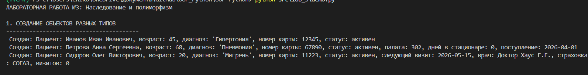
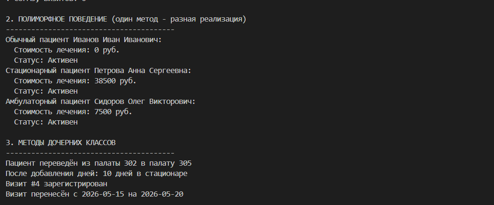
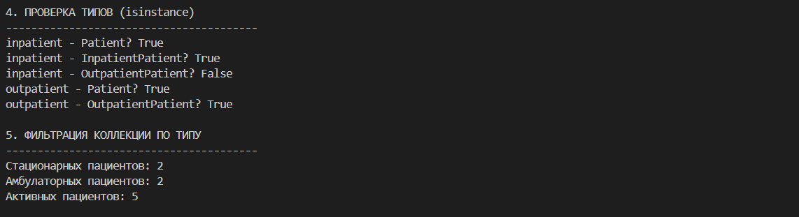
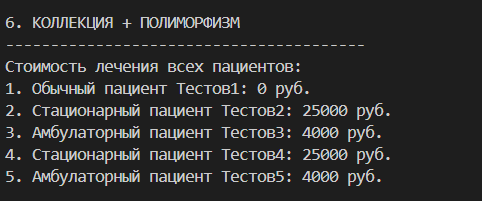
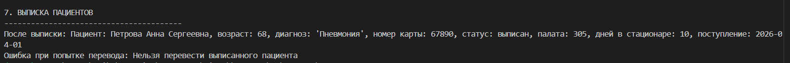

# ЛР-3 — Наследование и иерархия классов

### Базовый класс (Patient)
- Инкапсуляция атрибутов (ФИО, возраст, диагноз, номер карты)
- Валидация данных
- Методы: выписка, восстановление, изменение диагноза

### Дочерние классы

#### InpatientPatient
**Новые атрибуты:**
- `ward` - номер палаты
- `admission_date` - дата поступления
- `daily_rate` - стоимость дня
- `days_stayed` - количество дней

**Новые методы:**
- `change_ward()` - перевод в другую палату
- `add_days()` - добавление дней пребывания

#### OutpatientPatient
**Новые атрибуты:**
- `next_appointment` - дата следующего визита
- `attending_doctor` - лечащий врач
- `insurance_company` - страховая компания
- `visits_count` - количество визитов

**Новые методы:**
- `add_visit()` - добавление визита
- `reschedule_appointment()` - перенос визита

### Полиморфное поведение
- `calculate_treatment_cost()` - разная реализация для каждого типа
- `get_patient_type()` - возвращает тип пациента
- `process()` - общий интерфейс обработки

## Демонстрация (demo.py)
1. Создание объектов разных типов

2. Полиморфные вызовы методов

3. Проверка типов через `isinstance()` и фильтрация коллекций

5. Коллекция + полиморфизм

6. Выписка пациента

