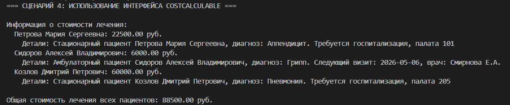
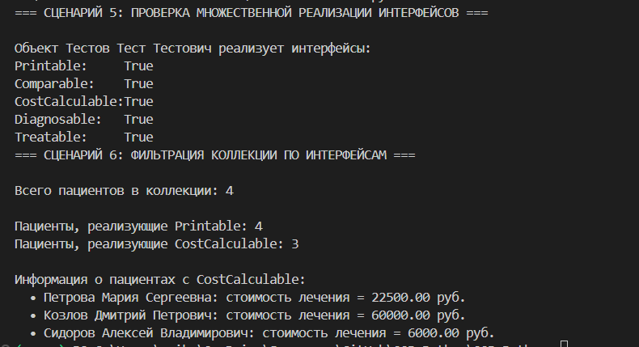
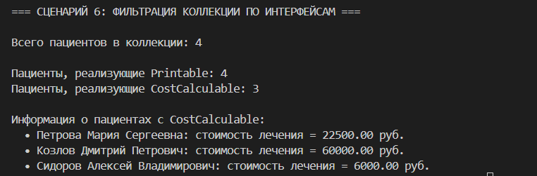

# Лабораторная работа №4 - Интерфейсы и абстрактные классы (ABC)

## 1. Цель работы

Изучение:
- Абстрактных базовых классов (ABC) в Python
- Интерфейсов как контрактов поведения
- Полиморфизма через единый интерфейс
- Множественной реализации интерфейсов
- Проектирования архитектуры на основе интерфейсов

## 2. Описание интерфейсов

Создано 5 интерфейсов (ABC):

| Интерфейс | Метод | Назначение |
|-----------|-------|------------|
| `Printable` | `to_string()` | Преобразование объекта в строку для вывода |
| `Comparable` | `compare_to(other)` | Сравнение объектов (возвращает -1, 0, 1) |
| `CostCalculable` | `calculate_cost()` | Расчёт стоимости лечения |
| `Diagnosable` | `get_diagnosis_info()` | Получение информации о диагнозе |
| `Treatable` | `can_prescribe_medicine()` | Проверка возможности назначения лекарств |

## 3. Реализация в классах

### Класс `Patient` (базовый)
Реализует все интерфейсы:
- `to_string()` - базовая информация о пациенте
- `compare_to()` - сравнение по номеру карты
- `calculate_cost()` - возвращает 0 (базовая реализация)
- `get_diagnosis_info()` - диагноз и ФИО
- `can_prescribe_medicine()` - возраст >= 18 и активен

### Класс `InpatientPatient` (стационар)
Переопределяет:
- `to_string()` - добавляет информацию о палате и днях
- `calculate_cost()` - daily_rate * days_stayed
- `get_diagnosis_info()` - добавляет номер палаты

### Класс `OutpatientPatient` (амбулаторный)
Переопределяет:
- `to_string()` - добавляет дату визита и количество визитов
- `calculate_cost()` - consultation_price * visits_count
- `get_diagnosis_info()` - добавляет врача и дату визита
- `can_prescribe_medicine()` - возраст >= 21

## 4. Демонстрация

### Сценарий 1-2: Создание объектов и интерфейс Printable
Универсальная функция `print_all()` принимает любой список Printable  

### Сценарий 3: Интерфейс Comparable
Сравнение и сортировка через интерфейс  

### Сценарий 4: Интерфейс CostCalculable
Расчёт стоимости лечения для разных типов пациентов  

### Сценарий 5: Множественная реализация
Проверка реализации интерфейсов через `isinstance()`  

### Сценарий 6: Фильтрация коллекции
Методы `get_printable()`, `get_cost_calculable()`  

