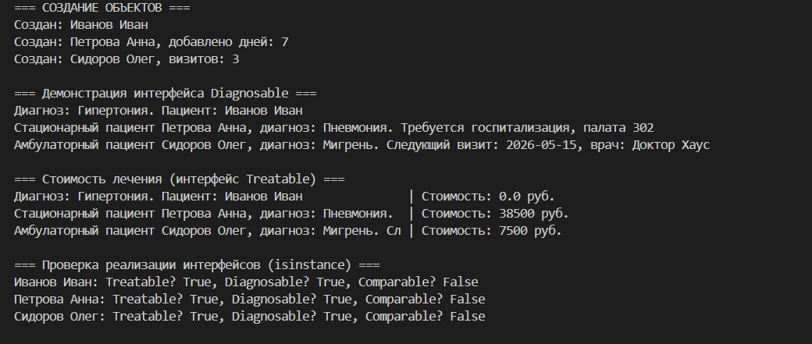
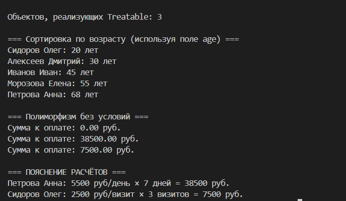

# Лабораторная работа №4: Интерфейсы и абстрактные классы

## Цель
Освоить механизм абстрактных базовых классов (ABC) в Python, научиться проектировать интерфейсы (контракты) и применять их для полиморфизма.

## Описание интерфейсов
- **Treatable** — требует метод `calculate_cost()` для вычисления стоимости лечения.
- **Diagnosable** — требует метод `get_diagnosis_info()` для получения информации о диагнозе.
- **Comparable** (дополнительно) — требует метод `compare_to()` для сравнения объектов.

## Реализация в классах
- `Patient` — реализует оба интерфейса: `calculate_cost()` возвращает 0, `get_diagnosis_info()` выдаёт базовую информацию.
- `InpatientPatient` — переопределяет `calculate_cost()` как `daily_rate * days_stayed`, дополняет диагноз информацией о палате.
- `OutpatientPatient` — `calculate_cost()` как `consultation_price * visits_count`, диагноз содержит дату визита и врача.

## Демонстрация (скриншоты)

