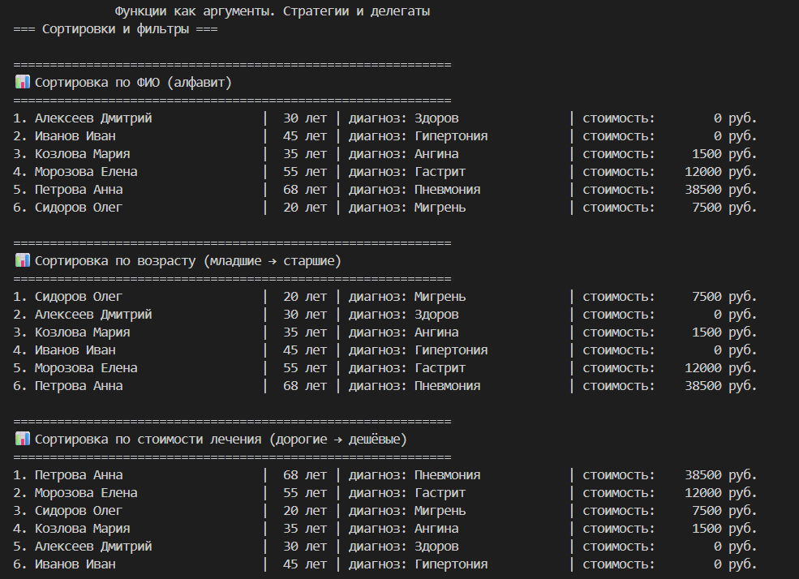
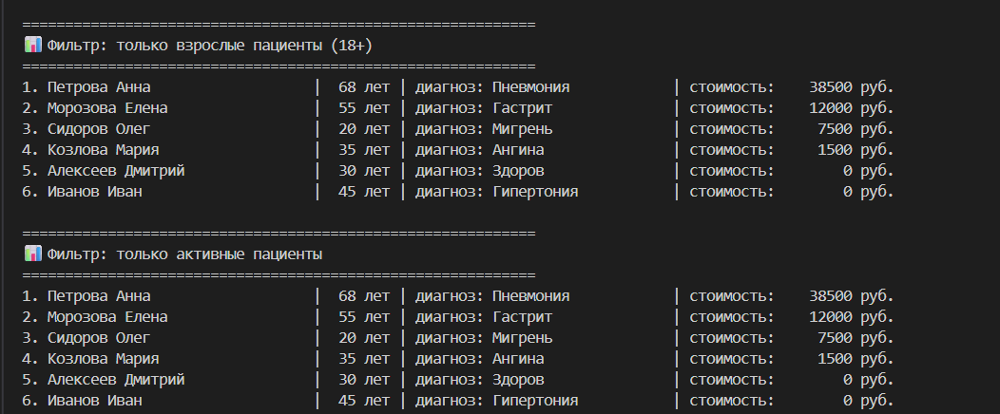
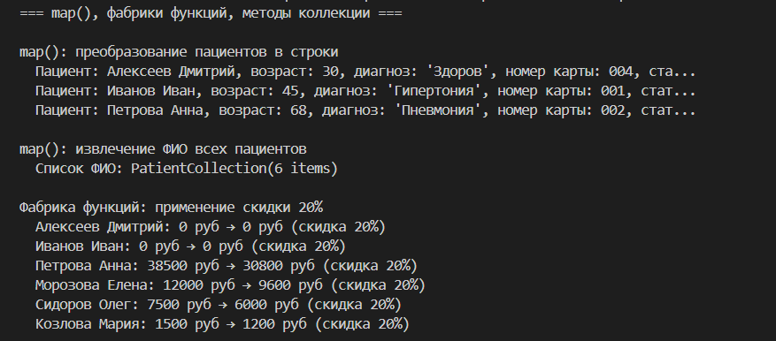
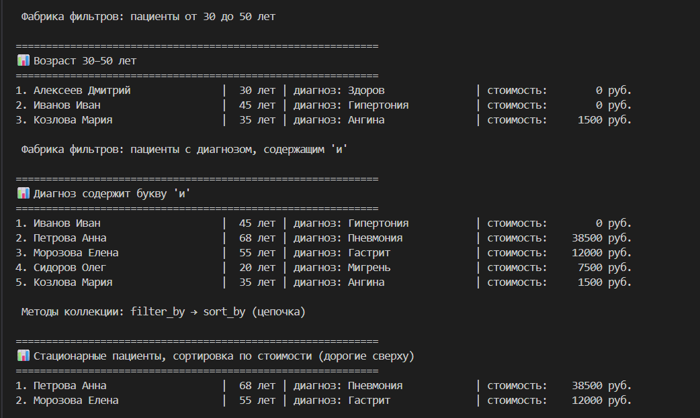
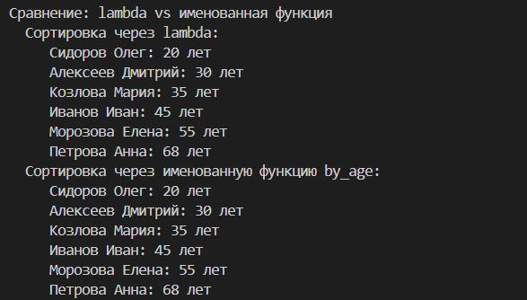
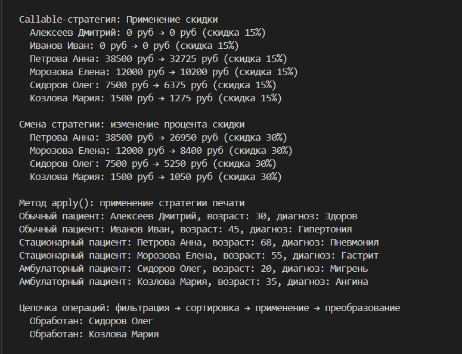
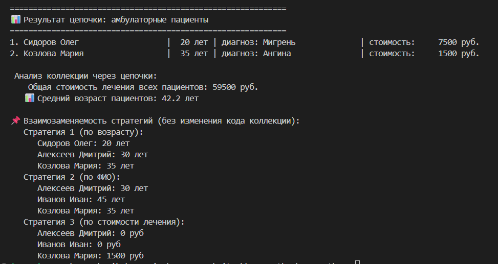

# Лабораторная работа №5: Функции как аргументы. Стратегии и делегаты.

## Цель работы
Освоить передачу функций как аргументов, применение `map`, `filter`, `sorted`, паттерн «Стратегия», `lambda`-выражения и интеграцию функционального стиля с ООП.

## Реализованные функции и стратегии

### Стратегии сортировки (ключи)
| Функция | Описание |
|---------|----------|
| `by_fio` | сортировка по ФИО |
| `by_age` | сортировка по возрасту |
| `by_cost` | сортировка по стоимости лечения |
| `by_multiple` | сортировка по нескольким атрибутам (возраст + ФИО) |

### Функции-фильтры (предикаты)
| Функция | Описание |
|---------|----------|
| `is_adult` | только взрослые (18+) |
| `is_active` | только активные пациенты |
| `is_inpatient` | только стационарные |
| `is_outpatient` | только амбулаторные |

### Фабрики функций
| Фабрика | Что возвращает |
|---------|----------------|
| `make_age_filter(min, max)` | фильтр по возрастному диапазону |
| `make_cost_filter(max)` | фильтр по максимальной стоимости |
| `apply_discount(percent)` | функция для применения скидки |

### Callable-объекты (паттерн Стратегия)
- `DiscountStrategy` — стратегия применения скидки, можно менять процент без изменения кода
- `PrintStrategy` — стратегия печати информации о пациенте

### Методы коллекции `PatientCollection`
| Метод | Описание |
|-------|----------|
| `sort_by(key_func, reverse)` | сортировка по стратегии |
| `filter_by(predicate)` | фильтрация |
| `apply(func)` | применение функции ко всем элементам |
| `map(transform_func)` | преобразование через `map()` |
| `reduce(func, initial)` | свёртка коллекции |

## Демонстрация работы

### Сценарий 1 
- Сортировка по ФИО, возрасту, стоимости лечения
- Фильтрация по взрослым и активным пациентам
# Лабораторная работа №5: Функции как аргументы. Стратегии и делегаты.

## Цель работы
Освоить передачу функций как аргументов, применение `map`, `filter`, `sorted`, паттерн «Стратегия», `lambda`-выражения и интеграцию функционального стиля с ООП.

## Реализованные функции и стратегии

### Стратегии сортировки (ключи)
| Функция | Описание |
|---------|----------|
| `by_fio` | сортировка по ФИО |
| `by_age` | сортировка по возрасту |
| `by_cost` | сортировка по стоимости лечения |
| `by_multiple` | сортировка по нескольким атрибутам (возраст + ФИО) |

### Функции-фильтры (предикаты)
| Функция | Описание |
|---------|----------|
| `is_adult` | только взрослые (18+) |
| `is_active` | только активные пациенты |
| `is_inpatient` | только стационарные |
| `is_outpatient` | только амбулаторные |

### Фабрики функций
| Фабрика | Что возвращает |
|---------|----------------|
| `make_age_filter(min, max)` | фильтр по возрастному диапазону |
| `make_cost_filter(max)` | фильтр по максимальной стоимости |
| `apply_discount(percent)` | функция для применения скидки |

### Callable-объекты (паттерн Стратегия)
- `DiscountStrategy` — стратегия применения скидки, можно менять процент без изменения кода
- `PrintStrategy` — стратегия печати информации о пациенте

### Методы коллекции `PatientCollection`
| Метод | Описание |
|-------|----------|
| `sort_by(key_func, reverse)` | сортировка по стратегии |
| `filter_by(predicate)` | фильтрация |
| `apply(func)` | применение функции ко всем элементам |
| `map(transform_func)` | преобразование через `map()` |
| `reduce(func, initial)` | свёртка коллекции |

## Демонстрация работы

### Сценарий 1 
- Сортировка по ФИО, возрасту, стоимости лечения
- Фильтрация по взрослым и активным пациентам

### Сценарий 2
- Применение `map()` для преобразования в строки и извлечения полей
- Фабрика фильтров для возрастного диапазона
- Цепочка `filter_by → sort_by`

### Сценарий 3
- Callable-стратегия `DiscountStrategy` с изменяемым процентом
- Полная цепочка: `filter_by → sort_by → apply → map`
- Подсчёт общей стоимости и среднего возраста через `reduce`

## Вывод
В ходе работы были освоены:
- Передача функций как аргументов
- `lambda`-выражения для краткой записи простых функций
- Встроенные функции высшего порядка (`map`, `filter`, `sorted`)
- Фабрики функций и замыкания
- Паттерн «Стратегия» через callable-объекты
- Интеграция функционального стиля с ООП (коллекция из ЛР-2)

