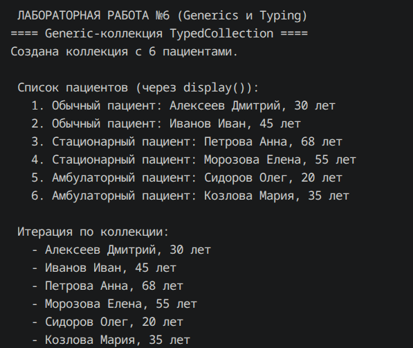
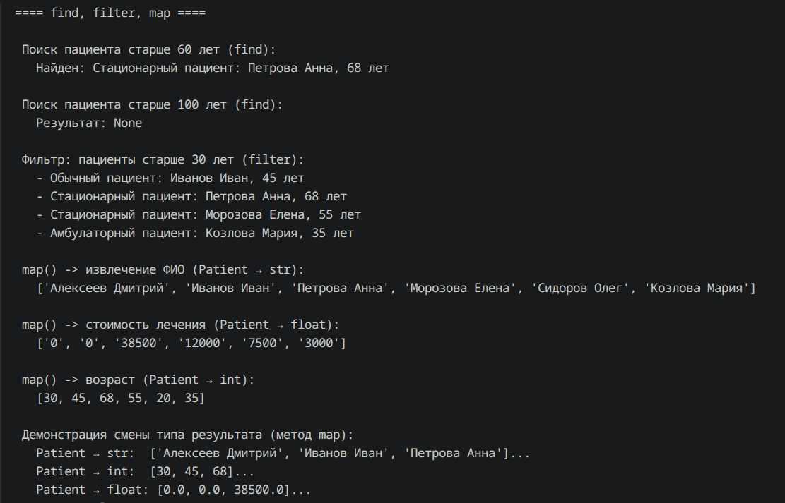
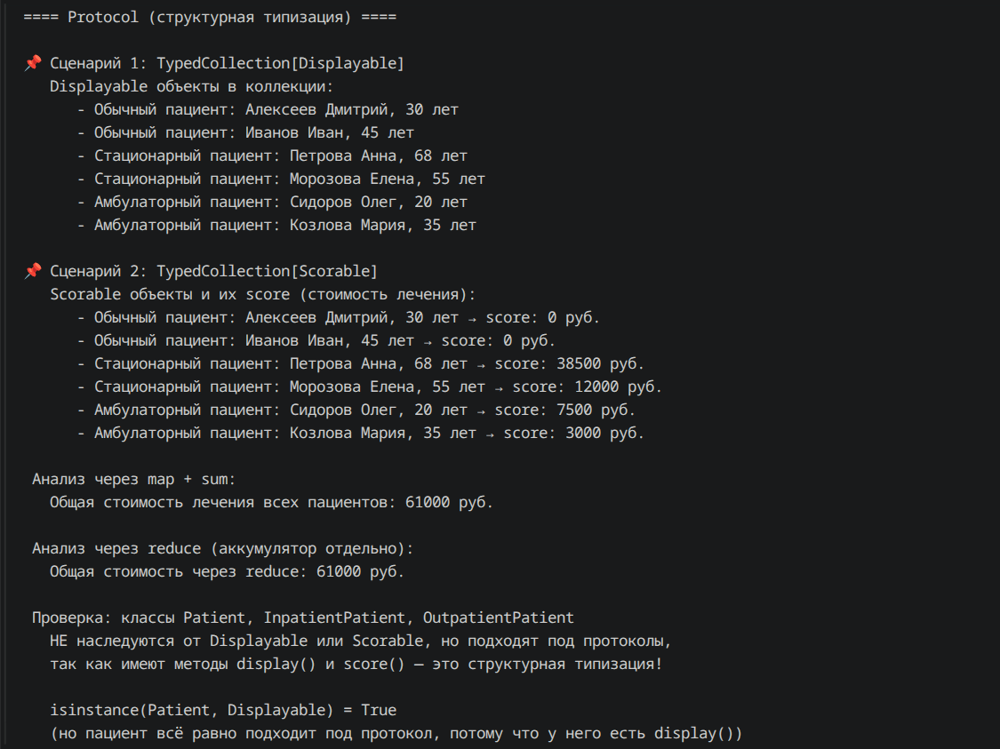

# Лабораторная работа №6: Generics и typing

## Цель работы
Освоить аннотации типов, Generic-классы, TypeVar, структурную типизацию через Protocol.

## Реализованные компоненты

### Аннотации типов 
Все классы (`Patient`, `InpatientPatient`, `OutpatientPatient`) получили полные аннотации параметров, возвращаемых значений и атрибутов.

### Generic-коллекция `TypedCollection[T]`
- Хранит элементы любого типа `T`
- Методы: `add`, `add_all`, `remove`, `get_all`, `find`, `filter`, `map`, `sort_by`

### Методы с TypeVar 
- `find(predicate: Callable[[T], bool]) -> Optional[T]`
- `filter(predicate: Callable[[T], bool]) -> list[T]`
- `map(transform: Callable[[T], R]) -> list[R]` – демонстрирует смену типа результата.

### Protocols и bound TypeVar 
- `Displayable` – требует метод `display() -> str`
- `Scorable` – требует метод `score() -> float`
- `TypedCollection[D]` с `bound=Displayable` – может хранить любые объекты, у которых есть `display()`, **без явного наследования**.

## Демонстрация 

